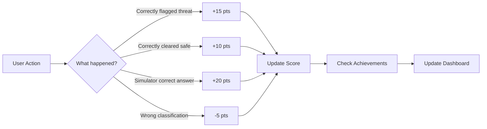

# SENTINEL AI — Full Project Explanation

## What Is SENTINEL AI?

SENTINEL AI is an **AI-powered cybersecurity intelligence platform** built for the **CODESTORM 2K26 Hackathon**. It helps users detect phishing emails, malicious URLs, social engineering attacks, and malware — while teaching them cybersecurity awareness through gamification.

Think of it as a **"VirusTotal meets Duolingo for cybersecurity"** — it analyzes threats AND educates users.

---

## Architecture Overview

```mermaid
graph TB
    subgraph "Frontend (React + Vite)"
        A[Browser - localhost:5174] --> B[React Router]
        B --> C[7 Pages]
        C --> D[Shared Components]
        D --> E[SentinelContext - Global State]
    end
    
    subgraph "Backend (Node.js + Express)"
        F[Express Server - port 3001] --> G[/api/analyze]
        F --> H[/api/chat]
        F --> I[/api/health]
    end
    
    A -->|HTTP Requests| F
    G -->|Optional| J[OpenAI API]
    G -->|Fallback| K[Heuristic Engine]
    H -->|Optional| J
    H -->|Fallback| L[Built-in Responses]
```

```
sentinel-ai/
├── client/                    ← React Frontend
│   ├── src/
│   │   ├── components/        ← Reusable UI pieces
│   │   │   ├── Sidebar.jsx
│   │   │   ├── Header.jsx
│   │   │   ├── ThreatMeter.jsx
│   │   │   ├── ThreatDNA.jsx
│   │   │   ├── ScoreRing.jsx
│   │   │   ├── AchievementBadge.jsx
│   │   │   └── AnalysisLoader.jsx
│   │   ├── pages/             ← 7 Full pages
│   │   │   ├── Analyzer.jsx
│   │   │   ├── Dashboard.jsx
│   │   │   ├── Simulator.jsx
│   │   │   ├── Chat.jsx
│   │   │   ├── History.jsx
│   │   │   ├── Reports.jsx
│   │   │   └── AwarenessHub.jsx
│   │   ├── context/           ← Global state management
│   │   │   └── SentinelContext.jsx
│   │   ├── hooks/             ← Custom React hooks
│   │   │   └── useThreatAnalysis.js
│   │   ├── utils/             ← Helper functions
│   │   │   └── reportGenerator.js
│   │   ├── App.jsx            ← Root component + routing
│   │   ├── main.jsx           ← Entry point
│   │   └── index.css          ← Full design system
│   ├── index.html
│   ├── vite.config.js
│   └── package.json
├── server/                    ← Node.js Backend
│   ├── index.js               ← Express server setup
│   └── routes/
│       ├── analyze.js         ← Threat analysis endpoint
│       └── chat.js            ← Chat assistant endpoint
├── .env                       ← API keys (optional)
├── package.json               ← Root scripts (runs both)
└── README.md
```

---

## Technology Stack

### Frontend

| Technology | Version | Purpose |
|---|---|---|
| **React** | 18+ | UI framework — component-based architecture |
| **Vite** | 8.x | Build tool — instant hot reload, fast bundling |
| **Tailwind CSS** | 4.x | Utility-first CSS framework for styling |
| **Framer Motion** | 12.x | Animation library — page transitions, hover effects, loading animations |
| **React Router** | 7.x | Client-side routing between 7 pages |
| **Recharts** | 3.x | Chart library — line charts, bar charts, pie charts on dashboard |
| **Lucide React** | 1.x | Icon library — 100+ icons used throughout |
| **React Hot Toast** | 2.x | Toast notification system |

### Backend

| Technology | Version | Purpose |
|---|---|---|
| **Node.js** | 18+ | JavaScript runtime for server |
| **Express** | 4.x | HTTP server framework — handles API routes |
| **OpenAI SDK** | 4.x | (Optional) Connects to GPT for AI-powered analysis |
| **dotenv** | 16.x | Loads environment variables from `.env` |
| **cors** | 2.x | Enables cross-origin requests from frontend |

### Dev Tools

| Tool | Purpose |
|---|---|
| **concurrently** | Runs server + client simultaneously with `npm run dev` |
| **Vite proxy** | Routes `/api/*` requests from frontend to backend (port 3001) |

---

## How Each Page Works

### 1. ⚡ Threat Analyzer (`/`)
The core feature. Users paste suspicious content (email, URL, message, or code).

**Flow:**
1. User pastes content → clicks "ANALYZE THREAT"
2. Binary rain loading animation plays (AnalysisLoader component)
3. Frontend sends `POST /api/analyze` with the content
4. Backend either:
   - Sends to **OpenAI GPT** (if API key is set in `.env`)
   - OR uses **heuristic keyword matching** (checks for phishing patterns like "verify your account", fake domains, urgency words)
5. Returns a structured JSON response with: classification, severity, confidence, indicators, threat DNA scores
6. Frontend displays: **ThreatMeter** (severity gauge), **classification badge**, **AI report** (with typewriter effect), **indicator chips**, and **Threat DNA bars**
7. Result is saved to global state (SentinelContext) → updates dashboard, history, score

### 2. 📊 Intelligence HQ (`/dashboard`)
Real-time analytics dashboard showing all scan data.

- **4 KPI cards** — Total Scans, Threats Detected, Safe Cleared, Awareness Score (with animated counters)
- **Line chart** — Awareness score progression over time
- **Bar chart** — Severity distribution (Low/Medium/High)
- **Live feed** — Recent scans with timestamps
- **Category breakdown** — Phishing/Malware/Social Engineering/Safe counts

### 3. 🎯 Phishing Simulator (`/simulator`)
A training game with 6 realistic email scenarios. Users must identify if each email is legitimate or a phishing attempt.

- **6 scenarios**: PayPal, Google Prize, IT Help Desk, FedEx, LinkedIn, GitHub (1 legitimate)
- **30-second timer** per scenario with time bonus scoring
- **Red flag highlighting** — after answering, phishing indicators are highlighted in the email
- **Score tracking** — correct answers earn points, wrong answers lose points
- **Completion screen** — final score with per-scenario breakdown

### 4. 🤖 SENTINEL Chat (`/chat`)
AI cybersecurity assistant for learning.

- **Suggestion chips** at top — quick questions about phishing, malware, etc.
- Sends messages to `POST /api/chat`
- Backend responds with either OpenAI-powered or pre-built cybersecurity knowledge
- **"S" avatar** for bot responses, typing indicator animation

### 5. 📋 Threat History (`/history`)
Searchable log of all past scans in the session.

- **Search bar** — filter by content text
- **Filter tabs** — All, Phishing, Malware, Social Engineering, Safe
- **Click any row** → opens a side drawer with full analysis details (ThreatMeter, DNA, indicators)
- **Clear History** button with confirmation

### 6. 📄 Report Center (`/reports`)
Generates a professional cybersecurity report from session data.

- **White preview card** — styled like a printed document with:
  - SENTINEL AI branding, report ID, timestamp
  - Analyst Score (0-100) with level label
  - Session Summary table (scans, threats, safe)
  - Detailed findings per scan
- **Export buttons**: PDF (print dialog), JSON (file download), Copy (clipboard)

### 7. 🧠 Awareness Score Hub (`/awareness`)
Gamified cybersecurity knowledge tracking.

- **Score Ring** — animated SVG circle showing 0-100 score
- **Level system** — Novice Analyst → Trainee → Cyber Aware → Security Pro → Cyber Defender
- **HOW SCORE WORKS** — explains point values (+15 for threats, +10 safe, +20 simulator, -5 false positive)
- **6 Achievement Badges** — First Catch, Eagle Eye, Safe Zone, Simulator Pro, Speed Analyst, Perfect Score
- **Score progression chart** — line graph over time

---

## How the Scoring System Works



All scoring happens in **SentinelContext.jsx** — a React Context that provides global state to every component:
- `awarenessScore` — current score (0-100)
- `scoreHistory` — array of score snapshots for charting
- `achievements` — unlocked achievement IDs
- `scanHistory` — all scan results
- `stats` — aggregated counts (threats, safe, by category, by severity)

---

## How the Backend Analysis Works

### With OpenAI API Key (production mode)
```
User Input → POST /api/analyze → OpenAI GPT-4 → Structured JSON → Frontend
```
The server sends the user's content to GPT with a detailed system prompt that instructs it to return a JSON object with: classification, severity, confidence, explanation, indicators, threat DNA scores, etc.

### Without API Key (demo/heuristic mode)
```
User Input → POST /api/analyze → Keyword Matching Engine → Structured JSON → Frontend
```
The heuristic engine checks for:
- **Phishing patterns**: "verify your account", "suspended", fake domains, urgency words
- **Malware patterns**: "download", "execute", suspicious file extensions
- **Social engineering**: "urgent", "CEO", "wire transfer", impersonation
- **Safe indicators**: no suspicious patterns found

This means the app works perfectly for demos without any API key!

---

## How to Run

```bash
# 1. Navigate to project
cd sentinel-ai

# 2. Install dependencies (first time only)
npm install
cd client && npm install && cd ..

# 3. Start both servers
npm run dev

# 4. Open browser
# → http://localhost:5173 (or 5174 if 5173 is in use)
```

### Optional: Enable AI-Powered Analysis
Edit `.env` in the root folder:
```
OPENAI_API_KEY=sk-your-key-here
```

---

## Key Design Decisions

| Decision | Why |
|---|---|
| **Heuristic fallback** | App works without API key — critical for hackathon demos |
| **React Context (not Redux)** | Simpler state management for a single-session app |
| **Vite (not CRA)** | 10x faster hot reload, modern ESM-based build |
| **Tailwind v4** | Latest version with `@theme` tokens for design system |
| **Framer Motion** | Smooth page transitions and micro-animations make it feel premium |
| **Monospace font (JetBrains Mono)** | Cybersecurity/hacker aesthetic matching the theme |
| **Session-based (no database)** | Everything lives in React state — resets on refresh, perfect for demos |
| **concurrently** | Single `npm run dev` starts both frontend and backend |
